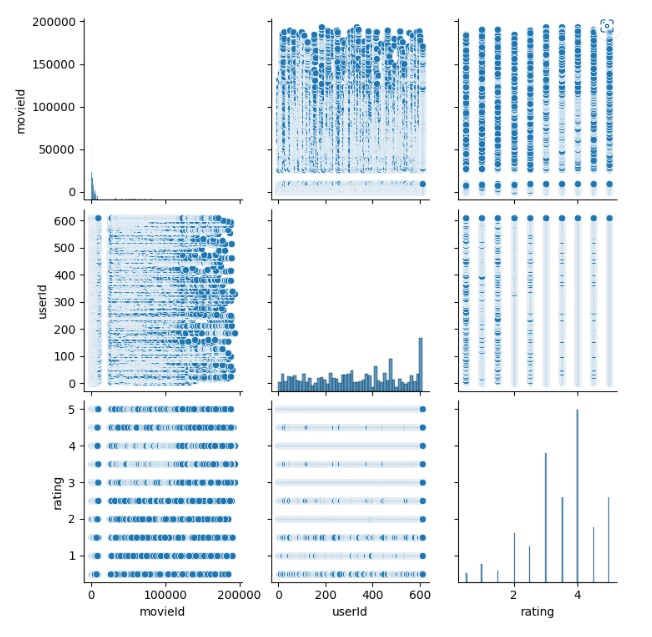
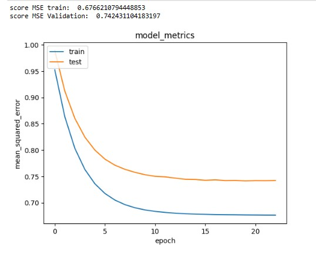

# Laporan Proyek Machine Learning - Mario Rangga Baihaqi

## Domain Proyek

Domain proyek ini akan memberikan dampak terhadap industri _platform_ penyiaran dengan judul proyek **"_film recommendation system_"**

**Latar Belakang**

Sistem rekomendasi film adalah teknologi yang membantu pengguna menemukan film yang sesuai dengan minat dan preferensi mereka. Ini sangat penting bagi industri film karena membantu meningkatkan pengalaman penonton dan mempermudah mereka untuk menemukan konten yang sesuai dengan keinginan mereka.

Sebagai industri yang berkembang pesat, industri film menghadapi tantangan dalam menarik perhatian dan mempertahankan minat penonton. Sistem rekomendasi film membantu memecahkan masalah ini dengan menyediakan rekomendasi film yang sesuai dengan minat dan preferensi penonton. Ini membuat mereka lebih mungkin untuk menonton film yang mereka sukai dan mempertahankan minat mereka pada industri film.

Sistem rekomendasi film juga membantu mempermudah proses pencarian film bagi pengguna. Tanpa sistem rekomendasi, penonton mungkin harus menelusuri berbagai situs web dan sumber daya untuk menemukan film yang sesuai dengan keinginan mereka. Sistem rekomendasi mempermudah proses ini dengan memberikan rekomendasi film yang sesuai dengan minat dan preferensi mereka, sehingga mereka dapat menemukan film yang sesuai dengan cepat dan mudah.

Sistem rekomendasi film juga membantu industri film memahami minat dan preferensi penonton. Ini memungkinkan industri film untuk memproduksi konten yang lebih sesuai dengan kebutuhan dan preferensi penonton, sehingga membantu meningkatkan popularitas dan menarik perhatian penonton baru.

Secara keseluruhan, sistem rekomendasi film merupakan bagian penting dari industri film yang membantu meningkatkan pengalaman penonton, mempermudah pencarian film, dan memahami minat dan preferensi penonton. Ini merupakan investasi yang bernilai bagi industri film dan membantu memastikan masa depan yang sukses bagi industri ini.

Jumlah film yang dirilis di Amerika Serikat dan Kanada masih jauh dari standar pra-pandemi. Pada tahun 2021, bioskop di kedua negara memulai 403 judul, kurang dari setengah dari 873 film fitur yang diluncurkan pada tahun 2018. Melihat angka kumulatif selama beberapa dekade terakhir menunjukkan pola dalam industri ini. Lebih dari sepertiga dari 15.84 ribu film yang dirilis di pasar Amerika Utara antara tahun 1995 dan 2022 adalah drama. Komedi dan dokumenter mengikuti, masing-masing genre menyumbang sekitar 15 persen dari rilis film fitur dalam periode tersebut. Sementara itu, sebagian besar pendapatan box office berasal dari produksi bertaraf PG-13. Secara keseluruhan, film yang, menurut Asosiasi Gambar Bergerak (MPA), berisi "beberapa materi mungkin tidak sesuai untuk anak-anak di bawah 13 tahun" menghasilkan lebih dari 117 miliar dolar AS secara domestik selama 27 tahun tersebut [[1](https://www.statista.com/topics/964/film/#topicOverview)].

## Business Understanding

Berdasarkan latar belakang, dapat disimpulkan bahwa industri film terus berkembang dengan penghasilan domestik sebesar 117 miliar selama 27 tahun. Dengan keadaan ini tentunya platform penyedia layanan film harus mempunyai sistem yang dapat mengetahui apakah suatu film layak untuk dimasukkan ke dalam _platform_ atau sistem untuk merekomendasikan _film-film_ terbaik yang _platform_ miliki. Dengan demikian proyek ini akan membuat sistem rekomendasi film yang dapat digunakan pada industri per _film_ an

Proyek ini akan menggunakan model _machine learning_ sistem rekomendasi menggunakan _content based filtering_ dan _collaborative filtering_.


### Problem Statements

Dengan demikian maka rumusan masalah diuraikan sebagai berikut:
- Bagaimana cara mengolah data movies untuk sistem rekomendasi?
- Bagaimana cara membuat model prediksi terhadap data yang telah diolah agar menghasilkan prediksi yang akurat?

### Goals

Tujuan dari proyek ini sebagai berikut:
- Data diolah dengan diberlakukan teknik yang dapat dibaca oleh model dan meningkatkan akurasi model.
- Data diimplementasi kan terhadap sistem rekomendasi berbasis filtrasi konten dan filtrasi kolaborasi.


### Solution Approach

penyelesaian _content based filtering_ dilakukan seperti alur di bawah:
- Pada content based filtering data dilakukan penggabungan data _movie_ dan _rating_ dan penanganan _missing value_.
- Tahap implementasi model meliputi: 
vektorisasi data pada fitur genres dan melakukan _cosine similarity_ untuk menghitung kemiripan antar data.

Penyelesaian _collaborative filtering_ dilakukan seperti alur di bawah:
- Penggabungan data _movie_ dan _rating_, membuat id baru untuk _movie_, _user_ (_Label Encoding_), membagi data menjadi _train_ sebesar 80% dan _test_ sebesar 20% dan melakukan pengecekan _sparsity_.
- Tahap implementasi model dilakukan menggunakan optimasi adam dan teknik evaluasi _mean squared error_.

## Data Understanding

_Dataset_ yang digunakan merupakan data _movielens_ yang diunduh pada _website_ [grouplens](https://grouplens.org/datasets/movielens/). _Dataset movielens_ memiliki 4 _file_ yang terdiri dari data movie, rating, link dan tag. _Dataset_ merupakan data yang dapat digunakan untuk membuat sistem rekomendasi _content based filtering_ dan _collaborative filtering_. Penjelasan mengenai atribut pada dataset sebegai berikut:


### Movie.csv memiliki fitur sebagai berikut:

- _movieId_ : nomor identifikasi identifikasi
- _title_ : fitur ini berisikan judul film
- _genres_ : fitur ini berisikan genre dari suatu film yang dipisahkan dengan tanda '|'.

### Link.csv memiliki fitur sebagai berikut:
- _movieId_ : nomor identifikasi film
- _imdbId_ : nomor identifikasi imdb
- _tmdbId_ : nomor identifikasi tmdb.

### Tags.csv memiliki fitur sebagai berikut:
- _userId_ : nomor identifikasi user
- _movieId_ : nomor identifikasi film
- _tag_ : _user generated metadata_ tentang film.
- _timestamp_ : _timestamp_ merepresentasikan detik sejak tengah malam UTC pada tanggal januari 1970.

### Rating.csv memiliki fitur sebagai berikut:
- _userId_ : nomor identifikasi user
- _movieId_ : nomor identifikasi film
- _rating_ : rating dengan skala 5 yang didefinisikan pengguna.
- _timestamp_ : _timestamp_ merepresentasikan detik sejak tengah malam UTC pada tanggal januari 1970.


**Exploratory Data Anlysis**:

Grafik di bawah merupakan pair plot dari fitur movieId, userId dan _rating_.



Tabel di bawah menunjukkan data movie.csv memiliki genres terbanyak drama dengan jumlah 1053 dan title emma (1996) sebanyak 2.

|        |        title |  Genres |
|-------:|------------:|------:|
| unique |        9737 |   951 |
|    top | Emma (1996) | Drama |
|   freq |           2 |  1053 |

Tabel di bawah merupakan deskripsi dari data rating, dapat diketahui bahwa nilai terkecil rating berada pada 0.5 dan maksimal 5 dengan rata-rata rating sebesar 3.5.


|       | userId        | movieId       | rating        | timestamp    |
|-------|---------------|---------------|---------------|--------------|
| count | 100836.000000 | 100836.000000 | 100836.000000 | 1.008360e+05 |
|  mean |    326.127564 |  19435.295718 |      3.501557 | 1.205946e+09 |
|   std |    182.618491 |  35530.987199 |      1.042529 | 2.162610e+08 |
|   min |      1.000000 |      1.000000 |      0.500000 | 8.281246e+08 |
|   25% |    177.000000 |   1199.000000 |      3.000000 | 1.019124e+09 |
|   50% |    325.000000 |   2991.000000 |      3.500000 | 1.186087e+09 |
|   75% |    477.000000 |   8122.000000 |      4.000000 | 1.435994e+09 |
|   max |    610.000000 | 193609.000000 |      5.000000 | 1.537799e+09 |

Pada proyek ini menggunakan 2 file yaitu movie dan rating untuk membuat sistem rekomendasi, fitur genres akan digunakan untuk melakukan _content based filtering_ dan _fitur rating_ akan digunakan untuk membuat sistem rekomendasi _collaborative filtering_.

## Data Preparation content based filtering

Tahap ini merupakan penjabaran dari bagian _solution approach_, di bawah ini merupakan tahapan dalam melakukan _data preprocessing content based filtering_ 

**Data Merging**

Pada _dataset_ dilakukan penggabungan data berdasarkan movieId antara data _movie_ dan data _rating_. 

**Penanganan Missing Value**

Pada _dataset_ ini memiliki _missing value_ sebesar 52,549 pada kolom title, userId, genres dan timestamp. Pada proyek ini _missing value_ dilakukan pembuangan dikarenakan penerapan imputasi data yang sulit untuk kolom _title_.

## Data Preparation collaborative filtering

Tahap ini merupakan penjabaran dari bagian _solution approach_, di bawah ini merupakan tahapan dalam melakukan _data preprocessing collaborative filtering_ 

**Data Merging**

Pada _dataset_ dilakukan penggabungan data berdasarkan movieId antara data _movie_ dan data _rating_. 

**Generating new ID (Encoding)**

Pada _dataset_ ini memiliki fitur movieId dan UserId yang tidak terurut dan angka identifikasi yang terlalu besar, sehingga diperlukan pembuatan identifikasi baru dengan melakukan indexing yang dimulai dari 1.

**Splitting Dataset**

Pada tahap ini dilakukan pembagian data train sebesar 80% dan data test sebesar 20% tujuannya agar model dapat mengetahui tingkat performa model dengan melakukan evaluasi menggunakan data test.

## Modeling Content Based Filtering


Data yang telah diproses dilanjutkan kedalam tahap _modeling_. Pada _content based filtering_ dilakukan _pivoting_ tabel genre dengan melakukan pembuatan kolom baru dan membuat nilai pada kolom dan baris tersebut menjadi 1 jika di dalam kolom genre terdapat nilai yang menjadi kolom baru tersebut, setelah data di _pivot_ lalu dilakukan perhitungan _cosine similarity_ untuk menghitung kemiripan antar film.

pemberian rekomendasi dilakukan dengan code berikut:

```python
def movie_recommendations(title, similarity_data=cosine_sim_df, items=movie_new[['title', 'genre']], k=5):
    index = similarity_data.loc[:,title].to_numpy().argpartition(
        range(-1, -k, -1))
    
    closest = similarity_data.columns[index[-1:-(k+2):-1]]
    
    closest = closest.drop(title, errors='ignore')
 
    return pd.DataFrame(closest).merge(items).head(k)
```

pemanggilan fungsi tersebut seperti berikut:

```python
movie_recommendations('Secrets & Lies (1996)')
```

dengan output:
    
|  |                                             title |       Genre|
|------:|--------------------------------------------------:|------:|
|     0 |                        Friendly Persuasion (1956) | Drama |
|     1 | Gospel According to St. Matthew, The (Vangelo ... | Drama |
|     2 |                               Lost Horizon (1937) | Drama |
|     3 |                                      Ikiru (1952) | Drama |
|     4 |                                     Luther (2003) | Drama |


Dapat dilihat bahwa _cosine similarity_ menggunakan rekomendasi berdasarkan jenis genre yang sama pada film rekomendasi yang diberikan.

## Modeling Collaborative Filtering

Pada model ini data yang telah diproses dilakukan model fitting menggunakan model sebagai berikut:

    Model: "collaborative_filtering_model"
    __________________________________________________________________________________________________
    Layer (type)                   Output Shape         Param #     Connected to                     
    ==================================================================================================
    movie (InputLayer)             [(None, 1)]          0           []                               
                                                                                                    
    user (InputLayer)              [(None, 1)]          0           []                               
                                                                                                    
    movie_embedding (Embedding)    (None, 1, 1)         9743        ['movie[0][0]']                  
                                                                                                    
    user_embedding (Embedding)     (None, 1, 1)         612         ['user[0][0]']                   
                                                                                                    
    flatten_movies (Flatten)       (None, 1)            0           ['movie_embedding[0][0]']        
                                                                                                    
    flatten_users (Flatten)        (None, 1)            0           ['user_embedding[0][0]']         
                                                                                                    
    dot (Dot)                      (None, 1)            0           ['flatten_movies[0][0]',         
                                                                    'flatten_users[0][0]']          
                                                                                                    
    ==================================================================================================
    Total params: 10,355
    Trainable params: 10,355
    Non-trainable params: 0
    __________________________________________________________________________________________________

Pada model ini pemberian rekomendasi dilakukan dengan menggunakan code sebagai berikut:

```python
def output_recommendation(x):
    
    movie_watched = throwback_df[throwback_df.newUserId == user_id]

    movie_not_watched = throwback_df[~throwback_df['newMovieId'].isin(movie_watched.newMovieId.values)][['title','rating','newMovieId']]

    movie_id_pred = model.predict(x)
    user_rate = movie_id_pred.flatten()

    top_rate_indices = user_rate.argsort()[-20:][::1]
    
    user_top_movie = movie_watched.sort_values(by='rating',ascending=False)['title'].values
    
    movie_rec = []
    counter_rec = 0
    for _ in top_rate_indices:
        movie_rec_title = movie_not_watched[movie_not_watched['newMovieId'] == _]['title'].unique()
        if movie_rec_title.size != 0 and counter_rec <= 10:
            movie_rec.append(movie_rec_title[0])
            counter_rec += 1
    
    print("recommendation for user_id: ",user_id)
    print("="*20)
    print("top 3 movie by user: ")
    counter_user = 0
    for i in user_top_movie:
        counter_user += 1
        if counter_user <= 3:
            print(i)
            
    print("="*20)
    print("recommendation by system:")
    
    for i in movie_rec:
        print(i)
        
    return None
```

dengan pemanggilan fungsi sebagai berikut:

```python
user_id = throwback_df.newUserId.sample(1).iloc[0]
user_df_x = throwback_df[throwback_df['newUserId'] == user_id]
x = [user_df_x['newUserId'],user_df_x['newMovieId']]

output_recommendation(x)
```
Pada code pemanggilan menggunakan user id yang diambil satu secara random dan dilakukan prediksi menggunakan fungsi output_recommendation.

dengan output sebagai berikut:

    recommendation for user_id:  228
    ====================
    top 3 movie by user: 
    Leaving Las Vegas (1995)
    Fargo (1996)
    Willy Wonka & the Chocolate Factory (1971)
    ====================
    recommendation by system:
    Babe (1995)
    To Die For (1995)
    Ace Ventura: When Nature Calls (1995)
    Clueless (1995)
    Sense and Sensibility (1995)
    Pocahontas (1995)
    Dangerous Minds (1995)
    Copycat (1995)
    Seven (a.k.a. Se7en) (1995)
    Grumpier Old Men (1995)
    American President, The (1995)

## Evaluation

Pada tahap ini dilakukan evaluasi untuk model collaborative filtering menggunakan metode evaluasi _Mean Squared Error_ dengan rumus MSE sebagai berikut:

$$MSE = 1/N * Σ (observed\ value - predicted\ value)^2$$

Mean Squared Error (MSE) adalah salah satu metrik yang digunakan untuk mengevaluasi kualitas suatu model prediksi. evaluasi ini menghitung rata-rata perbedaan antara nilai-nilai yang diamati dan nilai-nilai yang diprediksi. Lebih spesifik, MSE menghitung rata-rata dari kuadrat dari perbedaan antara nilai-nilai yang diamati dan nilai-nilai yang diprediksi.

Dengan demikian, jika model prediksi bekerja dengan baik, perbedaan antara nilai-nilai yang diamati dan yang diprediksi akan kecil, sehingga nilai MSEnya akan kecil. Sebaliknya, jika model prediksi tidak bekerja dengan baik, perbedaan antara nilai-nilai yang diamati dan yang diprediksi akan besar, sehingga MSE-nya akan besar. Pada proyek ini MSE akan mengukur antara hasil _rating_ prediksi dan nilai _rating_ sebenarnya.

Pada model ini hasil evaluasi ditunjukkan pada gambar di bawah:



Hasil MSE untuk train sebesar 0.67 dan hasil MSE untuk validation sebesar 0.74, hasil ini menunjukkan jarak antara nilai prediksi dan nilai sebenarnya pada testing data sebesar 0.74. Hasil ini menunjukkan jarak tidak sampai 1 yang artinya jarak cukup kecil dan performa model baik.

## _Referensi:_

[[1](https://www.statista.com/topics/964/film/#topicOverview)] Statista, januari 2023 https://www.statista.com/topics/964/film/#topicOverview


