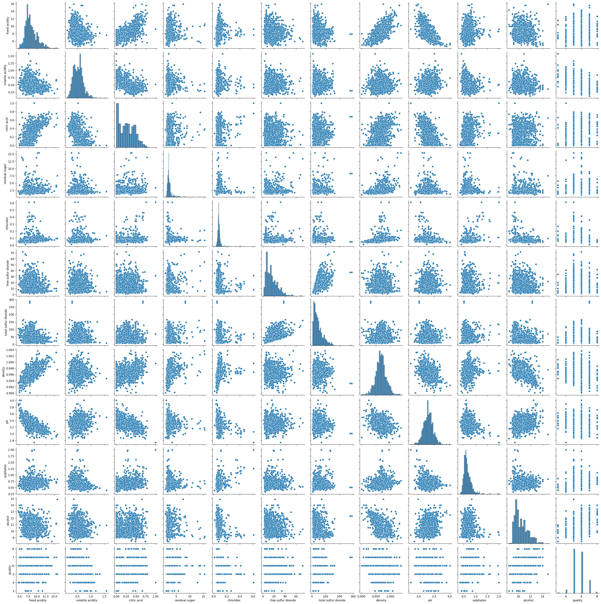
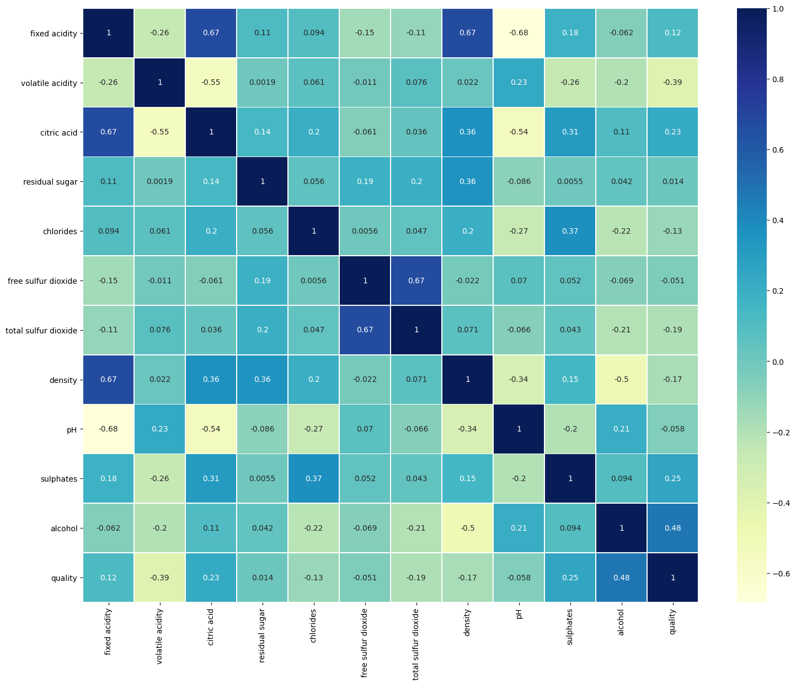
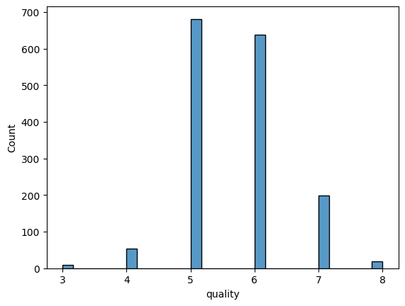
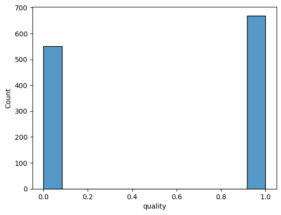

# Laporan Proyek Machine Learning - Mario Rangga Baihaqi

## Domain Proyek

Domain proyek ini akan memberikan dampak terhadap industri _wine_ dengan judul proyek **"Klasifikasi Qualitas _Wine_"**

**Latar Belakang**

Pendapatan di segmen _wine_ mencapai US$ 362,2 miliar pada tahun 2023. Pasar ini diperkirakan tumbuh setiap tahun sebesar 9,93% (CAGR 2023 - 2025). Dalam skala _global_, sebagian besar pendapatan dari _wine_ dihasilkan dari data Amerika Serikat sebesar US$ 60.910,00 juta pada tahun 2023. Pada tahun 2025 konsumsi _wine_ diluar rumah (bar dan resto) diprediksi akan mencapai pengeluaran sebesar 55% dengan tingkat konsumsi volume _wine_ sebesar 28%. Konsumsi _wine_ di tahun 2023 diperkirakan mencapai 3,32 L pada tahun 2023 dan mengalami pertumbuhan sebesar 3,7% pada tahun 2024 dan konsumsi _wine_ akan mencapai 27.312,3 ML pada tahun 2025 [[1](https://www.statista.com/outlook/cmo/alcoholic-drinks/wine/worldwide)].

Berdasarkan data tersebut maka dapat diketahui bahwa industri _wine_ akan terus berkembang dari tahun ke tahun, maka dengan itu proyek ini akan membahas tentang bagaimana menerapkan _machine learning_ untuk melakukan klasifikasi berdasarkan suatu _wine_, dengan model machine learning yang baik maka industri _wine_ atau sebuah perusahaan retail maupun produsen _wine_ dapat mengetahui parameter apa saja yang menjadikan suatu wine memiliki kualitas baik atau tidak.
  

## Business Understanding

Dengan pertumbuhan konsumsi _wine_ yang bertambah dari tahun ke tahun, maka dibutuhkan _wine_ dengan kualitas baik untuk pelaku usaha industri _wine_ dapat memuaskan konsumen dengan _wine_ yang dimiliki oleh pelaku usaha, lalu masalah yang muncul adalah bagaimana cara menentukan kualitas _wine_ yang baik?

Proyek ini akan menggunakan model _machine learning_ untuk melakukan klasifikasi apakah suatu _wine_ memiliki kualitas yang baik atau tidak dengan kualitas diwakili nilai antara satu sampai sepuluh pada dataset _wine_ _quality_.


### Problem Statements

Dengan demikian maka rumusan masalah diuraikan sebagai berikut:
- Bagaimana cara mengolah data _wine_ _quality_?
- Bagaimana cara membuat model prediksi terhadap data yang telah diolah agar menghasilkan prediksi yang akurat?

### Goals

Tujuan dari proyek ini sebagai berikut:
- Data diolah dengan diberlakukan teknik yang dapat dibaca oleh model dan meningkatkan akurasi model.
- Data diimplementasi kan terhadap 3 model klasifikasi dan dilakukan evaluasi terhadap model yang telah dibuat.


### Solution statements

Proyek ini menggunakan penyelesaian sebagai berikut:
- Tahap preprocessing meliputi: _handling missing value, Penanganan outlier, Scaling Data, Label Encoding, splitting dataset_.
- Tahap implementasi model meliputi: Komparasi performa 3 model klasifikasi menggunakan _accuracy, precision, recall dan f1-score_.

## Data Understanding

_Dataset_ yang digunakan merupakan data _wine quality_ yang diunduh pada _website_ [Kaggle](https://www.kaggle.com/datasets/uciml/red-wine-quality-cortez-et-al-2009). _Dataset wine quality_ memiliki 12 _independent variable_ dan 1 _dependent variable_. _Dataset_ merupakan data yang dapat digunakan untuk klasifikasi dengan target data melakukan prediksi kualitas suatu _wine_ dari nilai 1 hingga 10. _Dataset_ yang digunakan berisikan numerik atribut dengan tipe data float64. Penjelasan mengenai atribut pada dataset sebegai berikut:


### Variabel-variabel pada Wine Quality dataset adalah sebagai berikut:
- _Fixed Acidity_ : Tingkat asam tetap (g/dm)
- _Volatile Acidity_ : Tingkat asam volatile (g/dm)
- _Citric Acid_ : Tingkat asam organik (g/dm)
- _Residual Sugar_ : Tingkat gula (g/dm)
- _Chlorides_ : Tingkat klorida (g/dm)
- _Free Sulfur Dioxide_ : Tingkat sulfur bebas (mg/dm)
- _Total Sulfur Dioxide_ : Tingkat sulfur total (mg/dm)
- _Density_ : Tingkat densitas (g/cm)
- _pH_ : Tingkat pH
- _Sulphates_ : Tingkat sulfat (g/dm)
- _Alcohol_ : Tingkat alkohol (vol.%)

**Exploratory Data Anlysis**:

Grafik di bawah merupakan pair plot dari tiap atribut dan _target data_.



Grafik di bawah merupakan heatmap korelasi pearson dari tiap atribut dan _target data_.



Grafik di bawah merupakan persebaran _data target_ sebelum di _encode_.



Grafik di bawah merupakan persebaran setelah di _encode_.



Pada data _quality_ 1 merepresentasikan kualitas baik dan 0 buruk dengan data baik sebanyak 54.8% dan data buruk sebanyak 45.2%.

## Data Preparation

Tahap ini merupakan penjabaran dari bagian _solution statement_, di bawah ini merupakan tahapan dalam melakukan _data preprocessing_ 

**Data Transformation**

Pada _dataset_ ini satuan tiap fitur ada yang berbeda dengan yang lainnya seperi satuan g/dm dan ada yang g/cm, dengan demikian pada tahap ini dilakukan perubahan satuan atau penyeragaman

**Penanganan Outlier**

Pada tahap ini diperlukan penanganan _outlier_ untuk mengurangi bias pada juga, data _outlier_ merupakan data yang tidak normal dari persebaran data seharusnya. Pada project ini _outlier_ akan dieliminasi dengan menggunakan metode _z-score_ untuk meningkatkan performa model.

**Label Encoding**

Tahap ini merupakan tahap perubahan nilai target, pada _dataset_ ini nilai kualitas merupakan nilai _range_ dari 1 hingga 10, pada kasus kali ini data target dapat diubah menjadi biner untuk mengoptimalisasi proses klasifikasi. Sehingga pada _dataset_ target nilai diatas >= 6 diklasifikasikan sebagai kualitas baik dan nilai < 6 diklasifikasikan sebagai _wine_ kualitas buruk.

**Scaling Data**

Pada proses ini data diubah range nilainya menggunakan Min Max Scaler. Adapun tujuan dari scaling data agar model lebih cepat dalam mengolah data.


**Splitting Dataset**

Tahap ini merupakan tahap membagi data menjadi data latih sebesar 80% dan data uji sebesar 20%, dengan membagi data maka model dapat melakukan evaluasi dengan lebih akurat.

## Modeling

Data yang telah diproses dilanjutkan kedalam tahap _modeling_. Pada projek ini menggunakan tiga model klasifikasi yaitu _Logistic Regression, Support Vector Machine_ dan _Random Forest_.

Adapun kelebih dan kekurangan dari model yang digunakan sebagai berikut:

**Logistic Regression**

Regresi Logistik adalah metode statistik yang digunakan untuk memprediksi probabilitas terjadinya suatu kejadian dalam klasifikasi biner. Ini menentukan hubungan antara fitur independent dan respon dependent (kelas) menggunakan fungsi logistik. Pada proyek ini model ini memprediksi suatu _wine_ terklasifikasi baik atau tidak dengan atribut pada _dataset_ yang akan menentukan model logistik.

Keunggulan:

- Mudah diterapkan dan dijelaskan
- cepat dan efisien dalam sisi komputasi
- _robust_ terhadap _noise_
- bisa menggunakan metode regularisasi untuk menghindari _overfitting_.

Kelemahan:

- Terbatas pada relasi linear
- Buruk untuk data non linear

Pada proyek ini model _logistic regression_ yang digunakan merupakan _model raw_ (tanpa melakukan perubahan pada default parameter) pemanggilan model dilakukan seperi pada _code_ di bawah:

```python
from sklearn.linear_model import LogisticRegression
logreg = LogisticRegression()
```

**Support Vector Machine**

Support Vector Machine (SVM) adalah algoritme klasifikasi yang mencari garis pemisah (_hyperplane_) terbaik diantara kelas-kelas dalam data. SVM memaksimalkan jarak antara titik data dan garis pemisah untuk meminimalkan risiko klasifikasi yang salah. Pada proyek ini garis pemisah SVM akan memisahkan apakah suatu _wine_ diklasifikasikan sebagai baik atau tidak. 

Keunggulan:

- Bagus untuk non linear data
- robust untuk data berdimensi tinggi
- bisa diregularisasi untuk mencegah _overfitting_.

Kelemahan:

- lambat untuk data yang besar
- sulit untuk diinterpretasikan

Pada proyek ini _model Support Vector Machine_ yang digunakan merupakan _model raw_ (tanpa melakukan perubahan pada default parameter) pemanggilan model dilakukan seperi pada _code_ di bawah:

```python
from sklearn.svm import SVC
svc = SVC()
```


**Random Forest**

Random Forest adalah teknik ensembling yang menggabungkan beberapa pembuatan pohon keputusan (biasanya banyak) untuk membuat prediksi. Setiap pohon dalam hutan akan membuat prediksi sendiri, dan hasil akhir adalah hasil voting dari setiap pohon. Ini memungkinkan Random Forest untuk menangani masalah non-linear dan overfitting dengan baik. Pada proyek ini suatu _wine_ akan diprediksi berdasarkan _subset_ (_bagging_) hasil akhir dari setiap _tree_ akan dipilih yang paling banyak untuk hasil akhir klasifikasi.

Keunggulan:

- Memiliki performa baik untuk _dataset_ dalam jumlah besar
- baik untuk mengatasi non linear data
- dapat meng-_handle missing value_
- dapat digunakan untuk _feature selection_

Kelemahan:

- Memungkin untuk _overfitting_ dalam _dataset_ kecil
- sulit diinterpretasikan.

Pada proyek ini model _Random Forest_ yang digunakan merupakan _model raw_ (tanpa melakukan perubahan pada default parameter) pemanggilan model dilakukan seperi pada _code_ di bawah:

```python
from sklearn.ensemble import RandomForestClassifier
rfc = RandomForestClassifier()
```


## Evaluation

Proyek ini merupakan proyek klasifikasi. Dengan demikian maka digunakan metode evaluasi _Accuracy, Precision, Recall_ dan _f1 Score_.

Berikut formula dari metode evaluasi yang digunakan:

$$Accuray = (TP + TN)/TB$$

$$Precision = TP/(TP + FP)$$

$$Recall = TP/(TP + FN)$$

$$F1Score = 2*(Precision * Recall) / (Precision + Recall)$$

Pada metode evaluasi yang digunakan penjelasannya sebagai berikut:

- Akurasi merupakan formula yang membandingkan _actual value_ artinya semakin tinggi nilai _accuracy_, nilai TP atau TN pada model kita juga memiliki jumlah yang tinggi. 
- _Precision_ merupakan formula yang digunakan untuk mengetahui tingkat FP (_False positive_) semakin besar nilai _precision_ artinya semakin kecil nilai _false positive_ terjadi pada model. Pada proyek ini memiliki arti bahwa semakin kecil nilai _precision_ semakin besar kemungkinan model salah memprediksi bahwa _wine_ tersebut bagus.
- _Recall_ merupakan formula yang digunakan untuk mengetahui tingkat FN (_False Negative_) semakin besar nilai _recall_ artinya semakin kecil nilai _false negative_ terjadi pada model. Pada proyek ini _recall_ memiliki arti bahwa semakin kecil nilai _recall_ semakin besar kemungkinan model salah memprediksi bahwa wine tersebut buruk.
- f1 score merupakan formula yang digunakan untuk mengetahui model _precision_ dan _recall_, semakin mendekati 1 f1 score berarti model memiliki nilai _precision_ atau _recall_ yang baik.

Hasil evaluasi dapat dilihat pada tabel di bawah

| Model              | Accuracy | Precision | Recall | F1 Score |
|--------------------|----------|-----------|--------|----------|
| Logstic Regression | 0.733    | 0.767     | 0.738  | 0.752    |
| SVM                | 0.786    | 0.841     | 0.753  | 0.795    |
| Random Forest      | 0.819    | 0.868     | 0.791  | 0.828    |

Pada tabel dapat dilihat bahwa model _random forest_ mendapatkan performal lebih baik dibanding model lain dengan nilai akurasi 0.81, precision 0.86, recall 0.79 dan f1 score 0.82.
Pada proyek ini model Random Forest memiliki nilai f1 score yang paling mendekati 1 dan nilai _recall_ lebih rendah dibandingkan dengan _precision_, maka dengan itu _model random forest_ memiliki performa lebih baik untuk penyelesaikan model bisnis yang akan dilakukan.

## _Referensi:_

[[1](https://www.statista.com/outlook/cmo/alcoholic-drinks/wine/worldwide)] Statista, januari 2023 https://www.statista.com/outlook/cmo/alcoholic-drinks/wine/worldwide

[[2](http://dx.doi.org/10.1016/j.dss.2009.05.016)] P. Cortez, A. Cerdeira, F. Almeida, T. Matos and J. Reis. Modeling wine preferences by data mining from physicochemical properties.
In Decision Support Systems, Elsevier, 47(4):547-553, 2009.