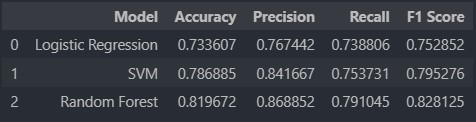

# Laporan Proyek Machine Learning - Mario Rangga Baihaqi

## Domain Proyek

Domain proyek ini akan memberikan dampak terhadap industri wine dengan judul proyek **"Klasifikasi Qualitas Wine"**

**Latar Belakang**

Pendapatan di segmen wine mencapai US$ 362,2 miliar pada tahun 2023. Pasar ini diperkirakan tumbuh setiap tahun sebesar 9,93% (CAGR 2023 - 2025). Dalam skala global, sebagian besar pendapatan dari wine dihasilkan dari data Amerika Serikat sebesar US$ 60.910,00 juta pada tahun 2023. Pada tahun 2025 konsumsi wine diluar rumah (bar dan resto) diprediksi akan mencapai pengeluaran sebesar 55% dengan tingkat konsumsi volume wine sebesar 28%. Konsumsi wine di tahun 2023 diperkirakan mencapai 3,32 L pada tahun 2023 dan mengalami pertumbuhan sebesar 3,7% pada tahun 2024 dan konsumsi wine akan mencapai 27.312,3 ML pada tahun 2025 [[1](https://www.statista.com/outlook/cmo/alcoholic-drinks/wine/worldwide)].

Berdasarkan data tersebut maka dapat diketahui bahwa industri wine akan terus berkembang dari tahun ke tahun, maka dengan itu proyek ini akan membahas tentang bagaimana menerapkan machine learning untuk melakukan klasifikasi berdasarkan suatu wine, dengan model machine learning yang baik maka industri wine atau sebuah perusahaan retail maupun produsen wine dapat mengetahui parameter apa saja yang menjadikan suatu wine memiliki kualitas baik atau tidak.
  

## Business Understanding

Dengan pertumbuhan konsumsi wine yang bertambah dari tahun ke tahun, maka dibutuhkan wine dengan kualitas baik untuk pelaku usaha industri wine dapat memuaskan konsumen dengan wine yang dimiliki oleh pelaku usaha, lalu masalah yang muncul adalah bagaimana cara menentukan kualitas wine yang baik?

Proyek ini akan menggunakan model machine learning untuk melakukan klasifikasi apakah suatu wine memiliki kualitas yang baik atau tidak dengan kualitas diwakili nilai antara satu sampai sepuluh pada dataset wine quality.

### Problem Statements

Dengan demikian maka rumusan masalah diuraikan sebagai berikut:
- Bagaimana cara mengolah data wine quality?
- Bagaimana cara membuat model prediksi terhadap data yang telah diolah agar menghasilkan prediksi yang akurat?

### Goals

Tujuan dari proyek ini sebagai berikut:
- Data diolah dengan diberlakukan teknik yang dapat dibaca oleh model dan meningkatkan akurasi model.
- Data diimplementasi kan terhadap 3 model klasifikasi dan dilakukan evaluasi terhadap model yang telah dibuat.

### Solution statements

Proyek ini menggunakan penyelesaian sebagai berikut:
- Tahap preprocessing meliputi: handling missing value, Penanganan outlier, Scaling Data, Label Encoding, splitting dataset.
- Tahap implementasi model meliputi: Komparasi performa 3 model klasifikasi menggunakan accuracy, precision, recall dan f1-score.

## Data Understanding

Dataset yang digunakan merupakan data wine quality yang diunduh pada website [Kaggle](https://www.kaggle.com/datasets/uciml/red-wine-quality-cortez-et-al-2009). Dataset wine quality memiliki 12 independent variable dan 1 dependent variable. Dataset merupakan data yang dapat digunakan untuk klasifikasi dengan target data melakukan prediksi kualitas suatu wine dari nilai 1 hingga 10. Dataset yang digunakan berisikan numerik atribut dengan tipe data float64. Penjelasan mengenai atribut pada dataset sebegai berikut:

### Variabel-variabel pada Wine Quality dataset adalah sebagai berikut:
- Fixed Acidity : Tingkat asam tetap (g/dm)
- Volatile Acidity : Tingkat asam volatile (g/dm)
- Citric Acid : Tingkat asam organik (g/dm)
- Residual Sugar : Tingkat gula (g/dm)
- Chlorides : Tingkat klorida (g/dm)
- Free Sulfur Dioxide : Tingkat sulfur bebas (mg/dm)
- Total Sulfur Dioxide : Tingkat sulfur total (mg/dm)
- Density : Tingkat densitas (g/cm)
- pH : Tingkat pH
- Sulphates : Tingkat sulfat (g/dm)
- Alcohol : Tingkat alkohol (vol.%)

**Exploratory Data Anlysis**:

Grafik di bawah merupakan pair plot dari tiap atribut dan target data.

Grafik di bawah merupakan heatmap korelasi pearson dari tiap atribut dan target data.

Grafik di bawah merupakan persebaran data target sebelum di encode.

Grafik di bawah merupakan persebaran setelah di encode.

Pada data quality 1 merepresentasikan kualitas baik dan 0 buruk dengan data baik sebanyak 54.8% dan data buruk sebanyak 45.2%.

## Data Preparation

Tahap ini merupakan penjabaran dari bagian solution statement, di bawah ini merupakan tahapan dalam melakukan data preprocessing 

**Handling Missing Value**

Pada dataset ini tidak ditemukan missing value, sehingga tidak diperlukan penanganan terhadap missing value. Tahap ini diperlukan untuk dapat mengurangi bias pada data jika terdapat missing value

**Penanganan Outlier**

Pada tahap ini diperlukan penanganan outlier untuk mengurangi bias pada juga, data outlier merupakan data yang tidak normal dari persebaran data seharusnya. Pada project ini outlier akan dieliminasi dengan menggunakan metode z-score untuk meningkatkan performa model.

**Scaling Data**

Pada proses ini data diubah range nilainya menggunakan Min Max Scaler. Adapun tujuan dari scaling data agar model lebih cepat dalam mengolah data.

**Label Encoding**

Tahap ini merupakan tahap perubahan nilai target, pada dataset ini nilai kualitas merupakan nilai range dari 1 hingga 10, pada kasus kali ini data target dapat diubah menjadi biner untuk mengoptimalisasi proses klasifikasi. Sehingga pada dataset target nilai diatas >= 6 diklasifikasikan sebagai kualitas baik dan nilai < 6 diklasifikasikan sebagai wine kualitas buruk.

**Splitting Dataset**

Tahap ini merupakan tahap membagi data menjadi data latih dan data uji, dengan membagi data maka model dapat melakukan evaluasi dengan lebih akurat.

## Modeling

Data yang telah diproses dilanjutkan kedalam tahap modeling. Pada projek ini menggunakan tiga model klasifikasi yaitu Logistic Regression, Support Vector Machine dan Random Forest.

Adapun kelebih dan kekurangan dari model yang digunakan sebagai berikut:

**Logistic Regression**

Keunggulan:

- Mudah diterapkan dan dijelaskan
- cepat dan efisien dalam sisi komputasi
- robust terhadap noise
- bisa menggunakan metode regularisasi untuk menghindari overfitting.

Kelemahan:

- Terbatas pada relasi linear
- Buruk untuk data non linear

**Support Vector Machine**

Keunggulan:

- Bagus untuk non linear data
- robust untuk data berdimensi tinggi
- bisa diregularisasi untuk mencegah overfitting.

Kelemahan:

- lambat untuk data yang besar
- sulit untuk diinterpretasikan

**Random Forest**

Keunggulan:

- Memiliki performa baik untuk dataset dalam jumlah besar
- baik untuk mengatasi non linear data
- dapat menghandle missing value
- dapat digunakan untuk feature selection

Kelemahan:

- Memungkin untuk overfitting dalam dataset kecil
- sulit diinterpretasikan.

Pada proyek ini model Random Forest memiliki nilai f1 score yang paling mendekati 1 dan nilai recall lebih rendah dibandingkan dengan precision, maka dengan itu model random forest memiliki performa lebih baik untuk penyelesaikan model bisnis yang akan dilakukan.

## Evaluation

Proyek ini merupakan proyek klasifikasi. Dengan demikian maka digunakan metode evaluasi Accuracy, Precision, Recall dan f1 Score.

Berikut formula dari metode evaluasi yang digunakan:

Accuracy = (True positif + True Negatif) / Total pengamatan

Precision = True positif / (True positif + False positif)

Recall = True positif / (True positif + False negatif)

F1 score = 2 * (Precision * Recall) / (Precision + Recall)

Hasil evaluasi dapat dilihat pada gambar di bawah

Pada gambar dapat dilihat bahwa model random forest mendapatkan performal lebih baik dibanding model lain dengan nilai akurasi 0.81, precision 0.86, recall 0.79 dan f1 score 0.82.

## _Referensi:_

[[1](https://www.statista.com/outlook/cmo/alcoholic-drinks/wine/worldwide)] Statista, januari 2023 https://www.statista.com/outlook/cmo/alcoholic-drinks/wine/worldwide

[[2](http://dx.doi.org/10.1016/j.dss.2009.05.016)] P. Cortez, A. Cerdeira, F. Almeida, T. Matos and J. Reis. Modeling wine preferences by data mining from physicochemical properties.
In Decision Support Systems, Elsevier, 47(4):547-553, 2009.
